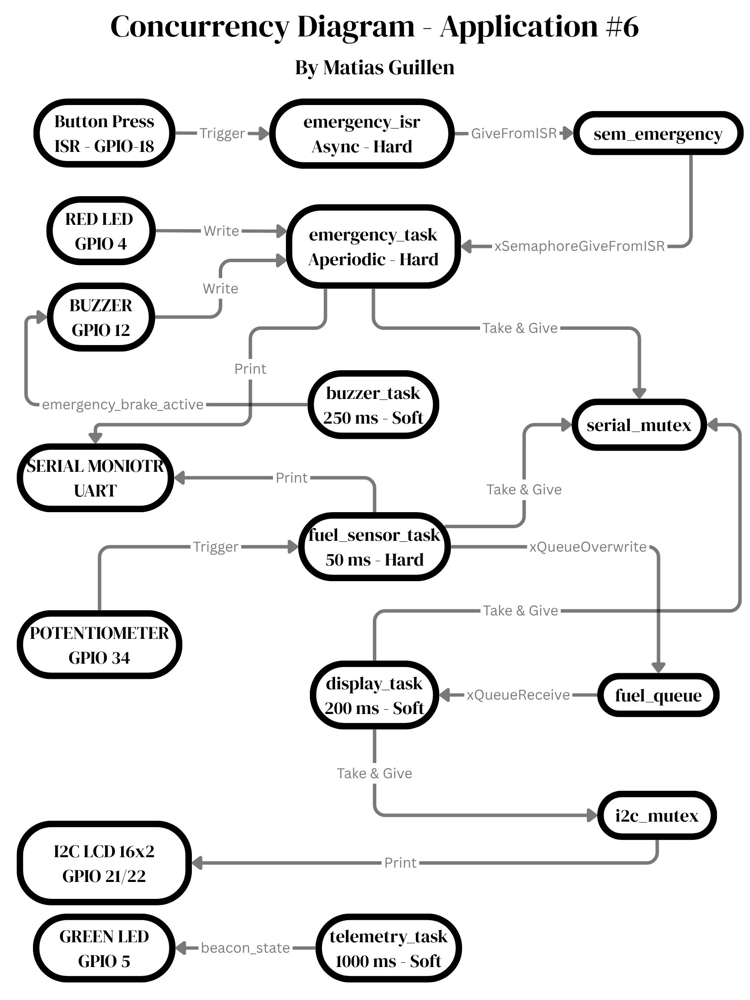
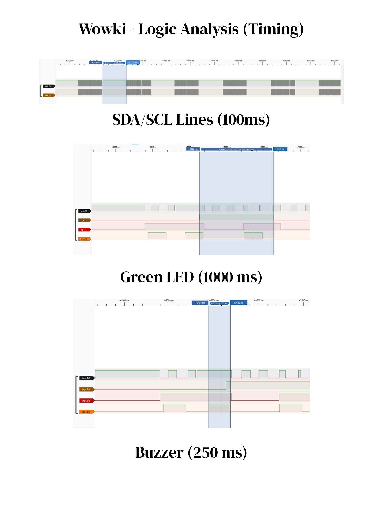
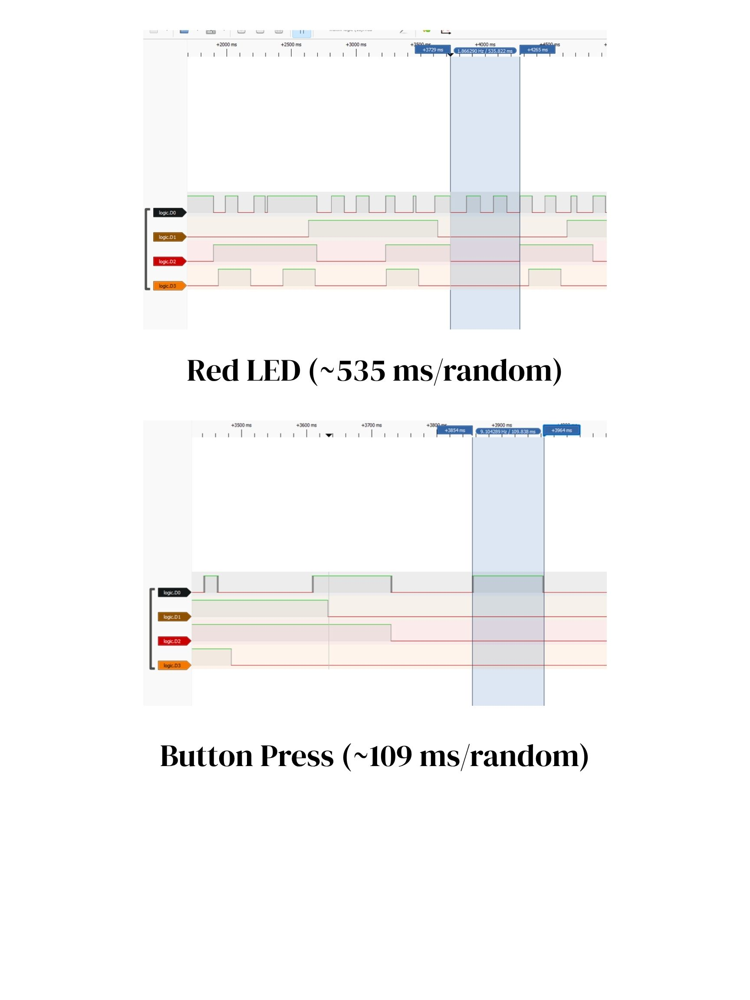

---
# You don't need to edit this file, it's empty on purpose.
# Edit theme's home layout instead if you wanna make some changes
# See: https://jekyllrb.com/docs/themes/#overriding-theme-defaults
layout: single
author_profile: true
---
# Application #6 - Real Time Systems:

#  Project Description:

Lockheed Martin has tasked a associate level embedded engineer to create an develop a pilot interface for the next upcoming jet model. This project consists of integration of a fuel injector (potentiometer), pilot display screen (I2C Display), telemetry signal (green LED), alarm signal (red LED), alarm sound (buzzer) and emergency button (button). The system has 5 tasks of varying priority and 1 ISR. The system uses at least two different distinct methods for synchronization including use of mutex, binary-semaphores and queues used for different purposes per each sub-system. When the pilot starts up the aircraft they will be interacing with two of the components including the fuel injector and button. When pressed, the button will engaged the emergancy break system and display a message on the LCD screen, the alarm will flash in warning and the alarm sound will play. When disengaged the alarms will turn off and the LCD screen will return to normal. For the fuel injector, when the knob is turned the fuel injection will vary between 0 - 100 (%) and the display screen (I2C) serial plot (UART) will show the value. At a value greater than 50 (%) the display will have a "H" next to the precentage and "L" when less than 50 (%). The final system is the telemetry which works independantly of the other components and will flash on and off every 1000 (ms). 

# Youtube Demo:

<iframe width="560" height="315" src="https://www.youtube.com/embed/NMmzstVzOKw" title="YouTube video player" frameborder="0" allow="accelerometer; autoplay; clipboard-write; encrypted-media; gyroscope; picture-in-picture" allowfullscreen></iframe>

# Wowki Prototype:

<iframe src="https://wokwi.com/projects/461831619489932289" width="100%" height="600px" style="border:none;"></iframe>

# Concurrency Diagram:

